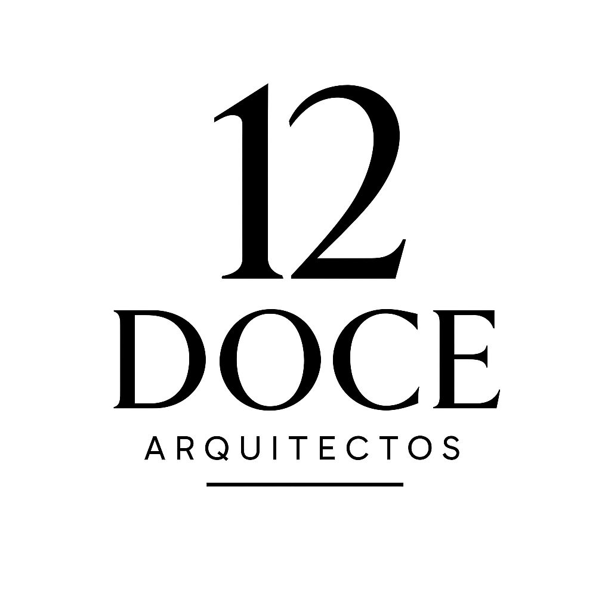

# 🏗️ Doce Arquitectos

**Despacho de Arquitectura en Saltillo, Coahuila**



---

## 📋 Descripción General

Sitio web profesional para **Doce Arquitectos**, despacho especializado en proyectos arquitectónicos, construcción, diseño de interiores y administración de obras en Saltillo, Coahuila.

---

## ✨ Características Principales

| Característica | Estado |
|---------------|:------:|
| ✅ Diseño Responsive Bootstrap 5 | ✅ |
| ✅ Animaciones WOW.js | ✅ |
| ✅ Carousel de proyectos | ✅ |
| ✅ Formulario de contacto funcional | ✅ |
| ✅ Sección de servicios | ✅ |
| ✅ Clientes y testimonios | ✅ |
| ✅ Optimización SEO | ✅ |
| ✅ Scroll horizontal interactivo | ✅ |

---

## 📱 Páginas del Sitio

| Página | URL | Descripción |
|--------|-----|-------------|
| 🏠 Inicio | `index.html` | Página principal con carousel y presentación |
| 👥 Somos | `about.html` | Equipo y experiencia del despacho |
| 🛠️ Servicios | `service.html` | Todos los servicios profesionales con scroll horizontal |
| 📞 Contacto | `contact.html` | Formulario y datos de contacto |

---

## 🚀 Tecnologías Utilizadas

| Frontend | Librerías |
|----------|-----------|
| HTML5 | Bootstrap 5 |
| CSS3 | Font Awesome 5 |
| JavaScript | Owl Carousel |
| | WOW.js |
| | jQuery |

---

## 📸 Galería de Secciones

### Hero Carousel
> Carousel principal con proyectos destacados

### Sección Servicios
> 6 servicios profesionales con diseño de tarjetas

### Proyectos Realizados
> Tabs con proyectos residenciales, comerciales e industriales

---

## 📧 Formulario de Contacto

✅ Validación cliente por campo
✅ Mensajes de error contextuales
✅ Envío directo por correo electrónico
✅ Estados de carga y confirmación

```html
<!-- Formulario funcional sin backend requerido -->
<form action="https://formsubmit.co/admin@12arquitectos.com.mx" method="POST">
```

---

## 🎨 Identidad Visual

```css
:root {
  --primary: #B78D65;   /* Color principal */
  --dark: #252525;      /* Color oscuro */
  --light: #F8F8F8;     /* Color claro */
}
```

Tipografías:
- `Open Sans` para texto general
- `Teko` para encabezados

---

## ⚡ Rendimiento

| Métrica | Optimización |
|---------|:------------:|
| Google Fonts | Carga asíncrona |
| Scripts | Carga diferida |
| DNS | Prefetch de dominios externos |
| Meta etiquetas | SEO On-Page completo |

---

## 📍 Datos de Contacto

📞 **Teléfono:** 844 264 0385  
📧 **Email:** admin@12arquitectos.com.mx  
📍 **Ubicación:** Saltillo, Coahuila, México  

Redes sociales:
- [Facebook](https://www.facebook.com/profile.php?id=100085962446127)
- [Instagram](https://www.instagram.com/doce_arquitectos/)

---

## 👨‍💻 Desarrollo

```bash
# Ejecutar localmente
npx serve .

# Abrir en navegador
http://localhost:3000
```

---

<div align="center">
  <sub>Desarrollado para Doce Arquitectos © 2026</sub>
</div>